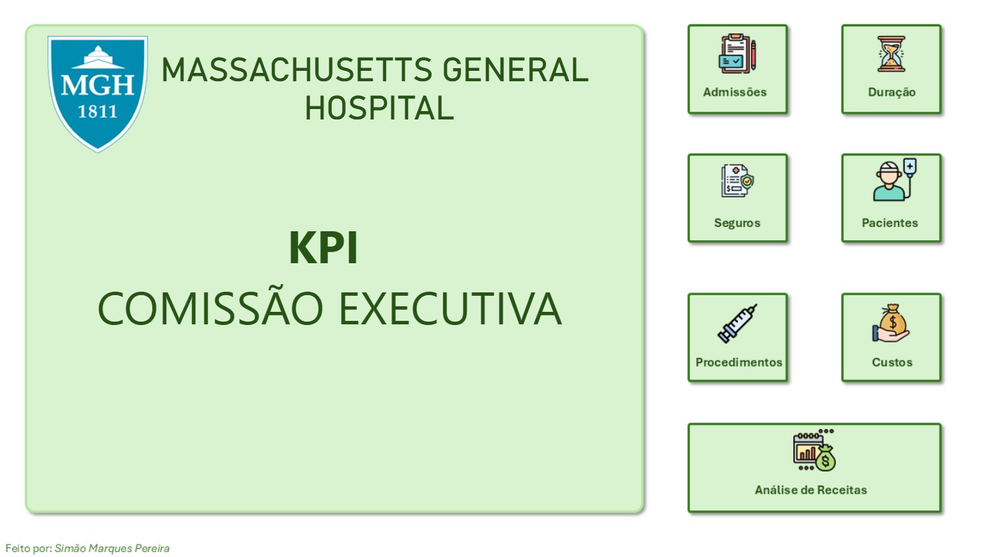

# KPI Analysis: Hospital Performance Dashboard

## Project Overview
This project showcases a dynamic dashboard created in Power BI to analyze key performance indicators (KPIs) for hospital operations. The dashboard aims to provide actionable insights into hospital performance metrics.

## Technologies Used
- **Power BI**: Dashboard creation and data visualization.
- **Data Sources**: Integrated datasets (structured and cleaned) to ensure accurate analysis.
- **Data Transformation**: ETL process performed using Power Query.

## Dashboard Preview
### Overview of the Dashboard

## Contacts
- **E-mail:** smp.1807@outlook.pt
- - **Linkedin:** [Simão Pereira](https://www.linkedin.com/in/sim%C3%A3o-pereira-58b39a255/)
